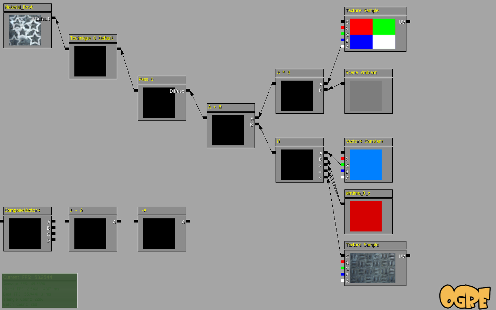
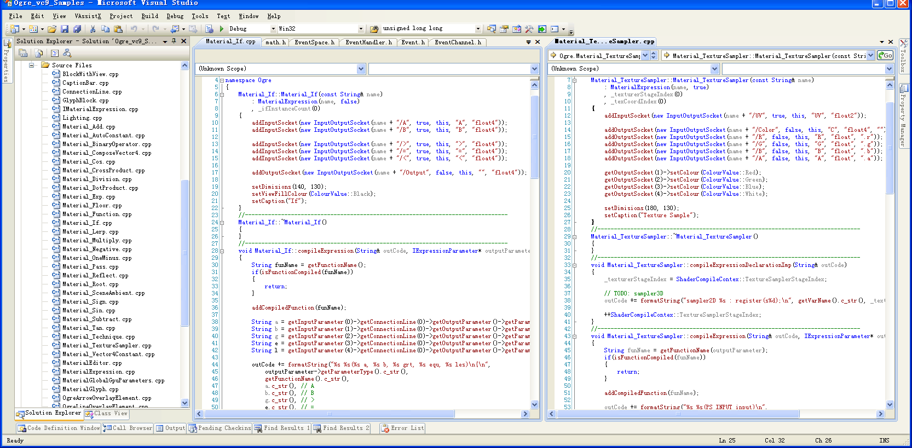

# Shader Editor of Ogen (Ogre Game Engine)
这个工程是之前自己基于OGRE写的一个引擎的一部分代码，时间有点久了，大概在2009年左右，再早之前（2005左右）和同事构思实现个类似ShaderX的图形化shader编辑器，后来ShaderX被UE3收购去了，反正现在类似的编辑器已经很多了，不管是U3D还是UE4都有，而且UE4还开源，只是有点复杂，当时可没有什么代码可以参考，所以就按自己的意思搞了一个，后来由于工作变动没有继续开发下去，当时也没花多少心思去把结构写得优雅一点，随便玩玩了。

部分截图：:smile_cat:
---------------------

ShaderEditor.avi有动态节点预览（居然当时还存了）