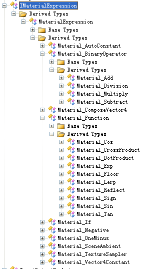
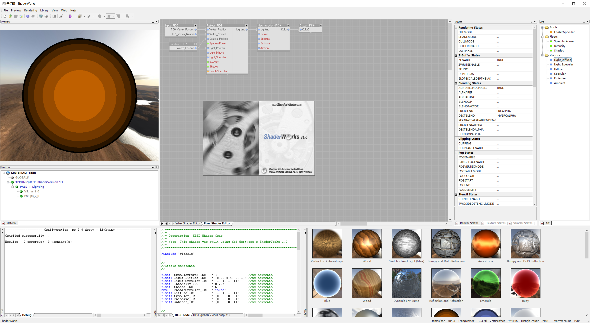

# Shader Editor of Ogen (Ogre Game Engine)
这个工程是之前自己基于OGRE写的一个引擎的一部分代码，时间有点久远了，大概在2009年左右，再早之前（2005左右）和同事构思实现个类似ShaderWorks的图形化shader编辑器，后来ShaderWorks被UE3收购去了，反正现在类似的编辑器已经很多了，不管是U3D还是UE4都有（以及部分开源的独立工具），而且UE4也开源了，只是有点复杂。那个年代没有什么代码可以参考，所以就按自己的意思搞了一个，后来由于工作变动没有继续开发下去，当时也没花多少心思去把结构写得优雅一点，只能当随便玩玩了。

* 代码从各种箱底捞的，找到相应的OGRE1.62应该能放进去编译过。改天空了把原来的工程翻出来另外开个库放下。

部分截图：:smile_cat:
---------------------
* [ShaderEditor.avi](./ShaderEditor.avi)有动态节点预览（居然当时还存了）

* 顺便来张Ogen Editor的初期版本截图（后来用UE3了也没心思继续搞了，现在有U3D、UE4，渲染管线也变化较大，估计更没心思搞了），大概记得还有个完整点的版本带了过场动画编辑器的

* [ShaderWorks XT - Alpha 1.0 - Release 202.exe](./ShaderWorksXT-Alpha1.0-Release202.exe)ShaderWorks的截图，一不小心翻箱底又发现个存货，编程也是门考古学。
